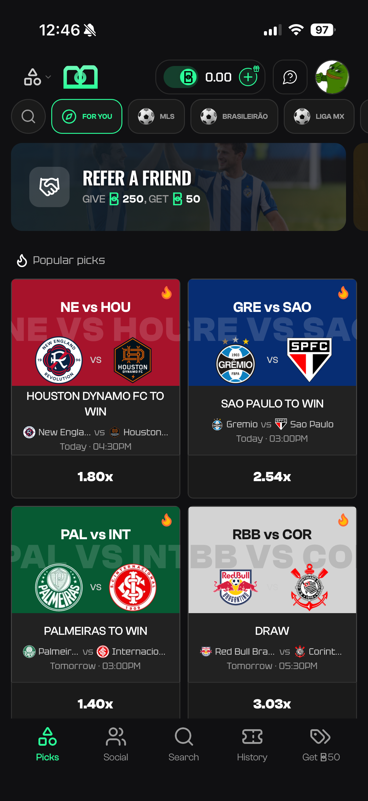
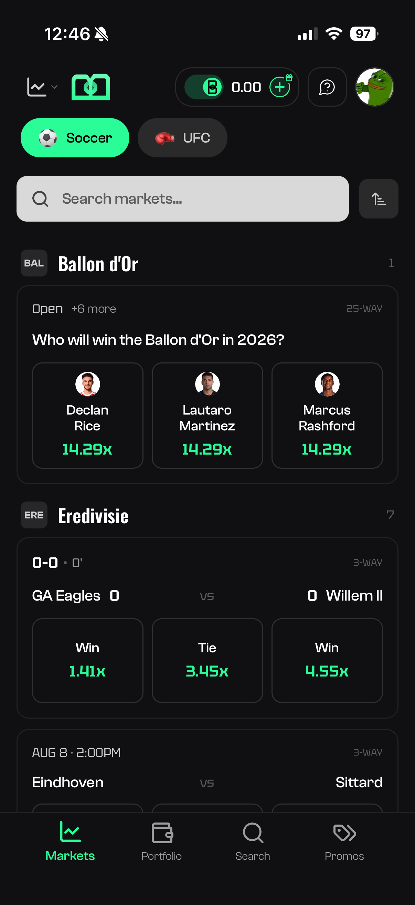
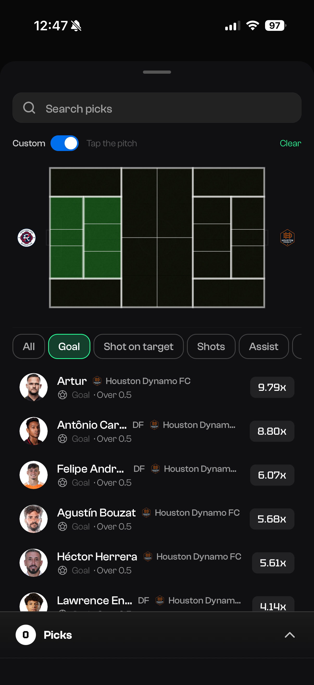
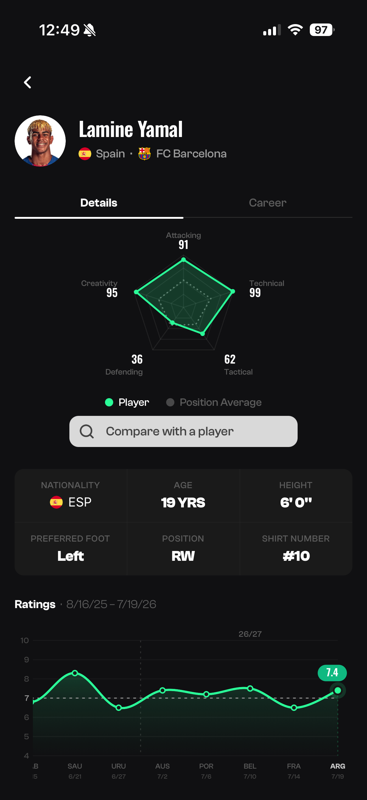
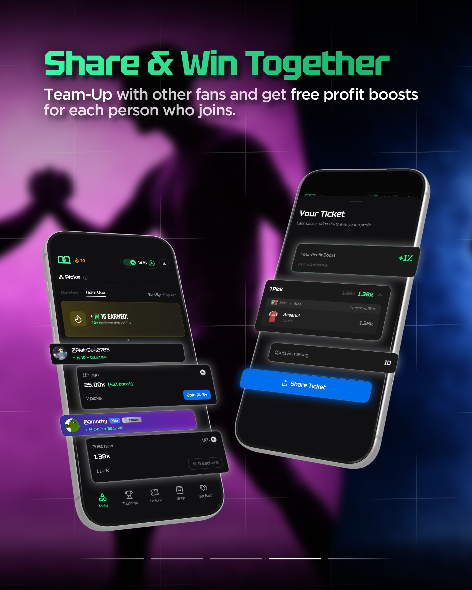
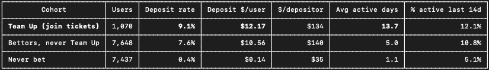
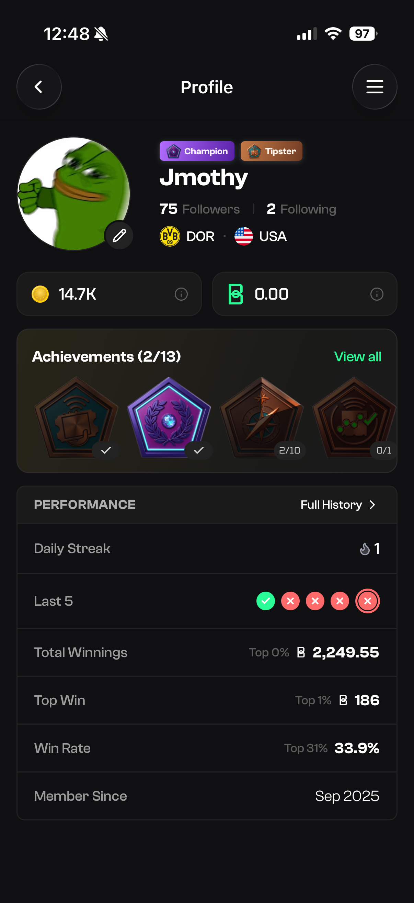
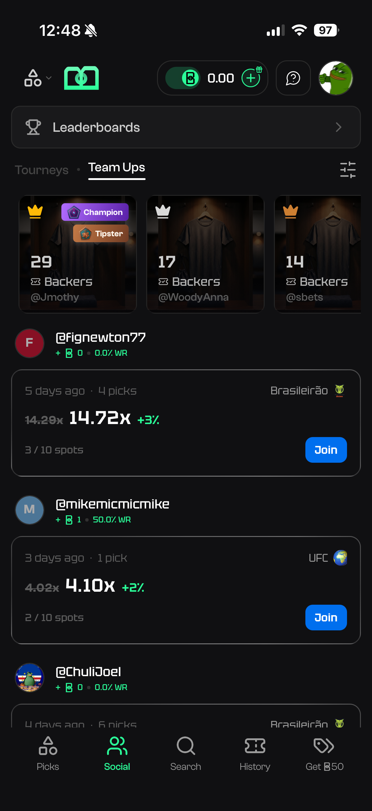
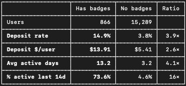
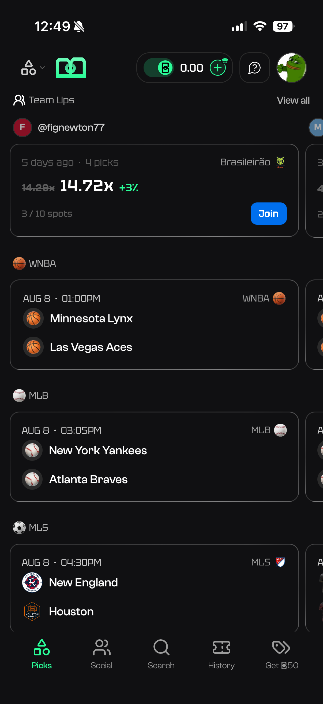

# TBG Picks — Product, Growth & UX Case Study

**Helping build and scale a social sports picks platform from launch to 30K+ installs**

TBG Picks was a consumer sports picks and sweepstakes platform built around a simple thesis: sports prediction products could be more social, approachable, and community-driven.

I joined the company shortly before launch as **Head of Marketing**. Although my title was marketing-focused, the company operated with a small core decision-making group consisting of the three founders and me.

My role consequently extended well beyond acquisition. I participated in product strategy, feature prioritization, UX decisions, monetization, community development, customer research, launch planning, analytics, and company-level decision making.

This repository documents selected examples of that work.

> **Confidentiality note:** TBG Picks' proprietary application source code and internal systems are intentionally excluded. This repository contains only portfolio-safe product documentation, aggregate metrics, public-facing product visuals, and examples of my own work.

---

## Scale & Scope

During my time at TBG Picks:

- Helped grow the product from launch to **30K+ installs in approximately nine months**
- Managed a **six-figure acquisition budget**
- Oversaw **20+ interns across four research groups**
- Managed acquisition across Meta, Google, Apple Search Ads, TikTok, Reddit, X, AppLovin, and additional channels
- Owned customer support, feedback, lifecycle messaging, community operations, and withdrawal operations
- Built and moderated a Discord community of approximately **240 members**
- Supported a product that generated **1,700+ deposits**
- Participated in the company's core four-person decision-making group alongside the three founders

My computer science and HCI background also allowed me to work closely with engineering on implementation tradeoffs, analytics, data models, feature specifications, and rollout considerations.

---

# The Product

TBG Picks combined traditional sports markets with social, community, and gamification mechanics.

<p align="center">
  
  
  
  
</p>

The product eventually included:

- Traditional match and player markets
- Proprietary soccer-specific zonal predictions
- Team Ups and social ticket discovery
- User profiles and following
- Achievements and status
- Tournaments and leaderboards
- Player statistics and comparison tools
- Promotions and rewards
- A dual-currency economy
- Multiple sports

---

# Selected Product Case Studies

## 1. Team Ups — Turning Uncertainty Into Social Participation

Early user research repeatedly surfaced the same problem: many users enjoyed sports but did not feel knowledgeable enough about soccer to confidently make picks.

Their workaround was often to research elsewhere or find successful users and copy what they were doing.

That created two problems:

1. Users were leaving the app to make decisions.
2. A potentially social behavior was happening outside the product.

I proposed **Team Ups**, originally called Bet Backing: a system that allowed users to join another user's ticket while making participation collaborative rather than purely duplicative.

Each additional participant increased the group's profit multiplier, giving the original creator an incentive to share and giving other users an approachable way to participate.

<p align="center">
  
</p>

### Product work

I wrote the original PRD and helped define:

- Social-feed discovery
- Internal and external sharing
- Deep links
- Backer limits
- Multiplier incentives
- Timing and cutoff rules
- Void behavior
- Per-user ticket records
- Feature-flag configuration
- Success, error, and loading states
- Social proof and creator credibility

Team Ups became a major part of the product's social layer.

### Adoption & behavior

Team Ups reached meaningful adoption across the user base.

A cohort analysis focused specifically on users who **joined another user's ticket** showed:

<p align="center">
  
</p>

Users in that cohort averaged **13.7 active days versus 5.0** for bettors who never joined a Team Up.

The comparison is correlational rather than causal—highly engaged users may also be more likely to use social features—but the analysis showed that Team Ups became strongly associated with some of the product's most engaged users.

[Read the full Team Ups case study →](case-studies/team-ups.md)

---

## 2. Achievements — Designing Status Around Valuable Behavior

TBG initially had a limited **Tipster** badge intended to establish credibility for users sharing picks.

Members of our Discord community began directly asking for additional badges regular users could earn.

Rather than treat achievements as profile decoration, I designed the expanded system around behaviors we wanted to reinforce:

- Returning consistently
- Creating tickets other users wanted to join
- Participating in tournaments
- Exploring different competitions
- Trying multiple market types
- Supporting other creators

<p align="center">
  
  
</p>

One important UX decision was making badges visible **outside the profile**.

Very few users visited other profiles, so hiding status there limited its value. We surfaced achievements alongside usernames in Team Ups and tournaments, allowing badges to serve as social proof at the moment users were deciding who to follow or join.

Users could showcase up to two achievements, creating both scarcity and identity.

### Behavior signal

Within the analyzed user base, **5.4% unlocked and displayed achievements**.

<p align="center">
  
</p>

Badge holders were dramatically more engaged than users without badges.

Because many achievements are earned specifically through high-engagement behaviors, this comparison should **not** be interpreted as badges causing the engagement difference. Instead, it demonstrated that the system successfully surfaced and recognized many of the platform's highest-value behaviors.

[Read the full Achievements case study →](case-studies/achievements.md)

---

## 3. Three Points Thursday — Redirecting Incentives Toward Weak Demand

TBG initially ran large profit boosts on selected high-profile matches.

I questioned the economics of subsidizing games users were already likely to engage with.

Instead, I analyzed product performance by weekday and identified Thursday as one of the product's weakest recurring periods.

I proposed moving promotional value away from isolated high-demand matches and toward an entire weak day.

The result was **Three Points Thursday**:

> Place up to three eligible tickets on Thursday and receive a 10% profit boost.

The name came from soccer's familiar "three points" terminology while creating a recognizable weekly event.

<p align="center">
  
</p>

[View the Three Points Thursday launch video](assets/launch/TBG-Ad-TPT.mp4)

### Outcome

Within the analyzed user base, **15.8% used the Three Points Thursday promotion**.

<p align="center">
  
</p>

Before launch, Thursday ranked near the bottom of the week for activity.

After launch, Thursday became the **highest-DAU weekday** in the measured period while maintaining a **+16.5% credit hold**, the second-highest positive hold percentage of the week.

The important result was not simply raw growth—the company itself was growing rapidly—but Thursday's performance **relative to the other weekdays operating during the same period**.

[Read the full Three Points Thursday case study →](case-studies/three-points-thursday.md)

---

## 4. Discord — Building a Customer-Discovery Loop

We researched how successful consumer sports companies had used community to create loyalty beyond the transactional product experience.

I proposed and built TBG's Discord community as both a retention channel and a continuous source of customer feedback.

The server included:

- Sport-specific discussion
- League-specific channels
- Live score bots
- Ticket sharing
- Hot-ticket discussion
- Tournaments
- Giveaways
- Feedback forums
- Bug reporting
- Announcements

<p align="center">
  
</p>

The community ultimately grew to approximately **240 members**.

More importantly, it became a recurring product-feedback channel.

For example, direct Discord requests helped lead to the expanded achievement system described above.

### Community cohort

<p align="center">
  
</p>

Among users we could confidently identify through the instrumented in-app Discord link, community participants represented an unusually high-engagement cohort.

The comparison is not causal: people willing to join a product's Discord are inherently likely to be more engaged.

The strategic takeaway was that the Discord had become a home for many of our most valuable users **and** a direct feedback channel for future product decisions.

[Read the full Discord case study →](case-studies/discord-community.md)

---

# Additional Product Work

The four case studies above represent deeper examples, but my role touched substantially more of the product.

## Profiles & Following

I worked directly with the CEO to define what information should appear on user profiles.

We prioritized quickly understandable credibility signals:

- Total winnings
- Largest win
- Win rate
- Recent results
- Followers / following
- Favorite club
- Favorite country

The goal was to let another user quickly answer:

> "Is this someone I want to follow?"

Following was deliberately separate from Team Ups. Users could explicitly follow creators and receive notifications when those users placed new tickets, creating a persistent social graph rather than a one-time interaction.

---

## Differentiation vs. Familiarity

TBG's proprietary zonal prediction system was originally central to the product.

User feedback revealed an important tension: zonal predictions were differentiated, but they were unfamiliar enough that some users did not want them to be their only option.

I raised this issue with the team and advocated for adding familiar match and player markets **alongside**, rather than instead of, the differentiated zonal experience.

This allowed new users to enter through familiar behaviors while preserving the product's unique IP.

---

## Multi-Sport Expansion

TBG launched as a soccer-first product.

When expanding beyond soccer, I helped prioritize **baseball, tennis, and UFC** rather than simply launching marketing for every available sport.

The reasoning combined:

1. Seasonality — those sports had meaningful live inventory at the time.
2. Direct user demand — Discord members were actively requesting them.
3. Expected acquisition efficiency.

We deliberately did not prioritize major campaigns for sports that were out of season or had weaker evidence of near-term ROI.

<p align="center">
  
</p>

---

## User-Created & Private Tournaments

I proposed adding user-created and private tournaments so competition could happen within smaller social groups.

Potential uses included:

- Groups of friends
- Fans of the same club
- Community competitions
- Private Discord events
- Exclusive reward programs

This extended the product's social thesis beyond individual tickets and into repeat group competition.

---

## Risk, Withdrawals & Abuse

I personally handled withdrawal operations.

During that process, we identified users exploiting referral mechanics through self-referrals.

There was an internal disagreement about enforcement:

- I favored aggressively addressing abusive behavior to protect platform integrity.
- A founder was concerned that, at our early scale, immediately removing highly active users could destroy otherwise valuable customer relationships.

Rather than resolve the disagreement through instinct alone, we analyzed value signals including deposits, retention, hold, and other behavior and developed a **data-informed decision framework** for determining appropriate enforcement.

Exact fraud-detection methods and thresholds are intentionally not included.

---

## Launch & Lifecycle Execution

My role also included direct ownership of:

- Paid acquisition
- App Store positioning
- Social media
- Customer.io lifecycle messaging
- Surveys
- Support
- In-app user communication
- Promotional creative
- Manual push notifications
- Community moderation
- Influencer and partnership execution

That combination allowed user feedback, product development, marketing, and post-launch measurement to operate as a tight loop.

---

# How I Worked

A typical product loop looked like:

```text
User Feedback / Behavioral Data
              ↓
        Identify Problem
              ↓
      Define Product Hypothesis
              ↓
          Write PRD
              ↓
   UX + Engineering Tradeoffs
              ↓
             Ship
              ↓
       Position & Launch
              ↓
       Measure Behavior
              ↓
         Iterate Again
```

Because I also owned acquisition, support, lifecycle messaging, and community, I frequently saw the same product from several different perspectives:

**What users said → what users actually did → what engineering could build → what the business could support.**

---

# Growth

TBG Picks launched from zero installs and grew rapidly over the following nine months.

| Milestone | Approximate timing |
| --- | --- |
| Launch | Late 2025 |
| 1,000 installs | December 2025 |
| 5,000 installs | February 2026 |
| 10,000 installs | May 2026 |
| 30,000+ installs | World Cup period, 2026 |

These figures provide context for the product environment in which the case studies above were developed and tested.

---

# Skills Demonstrated

### Product

- Product discovery
- PRD writing
- Feature prioritization
- UX definition
- Gamification
- Social-product design
- Monetization strategy
- Product positioning

### Analytics

- Funnel analysis
- Cohort analysis
- Retention
- Engagement
- Deposits
- Hold
- Promotion performance
- Acquisition performance

### Growth

- Paid acquisition
- ASO
- Lifecycle messaging
- Referral strategy
- Community
- Promotional design
- GTM execution

### Collaboration

- Founder-level decision making
- Engineering collaboration
- User research
- Support-driven discovery
- Partner management
- Management of 20+ interns

---

# Source Code & Confidentiality

TBG Picks was a commercial product.

I did **not** write the core application source code, and proprietary company code is intentionally not reproduced in this repository.

My contribution centered on product strategy, UX, growth, analytics, customer discovery, feature definition, launch execution, and cross-functional decision making.

This repository documents only work and materials appropriate for a public professional portfolio.

---

## Project Status

TBG Picks operated from launch through 2026. This repository is an independent portfolio case study documenting my work on the product.