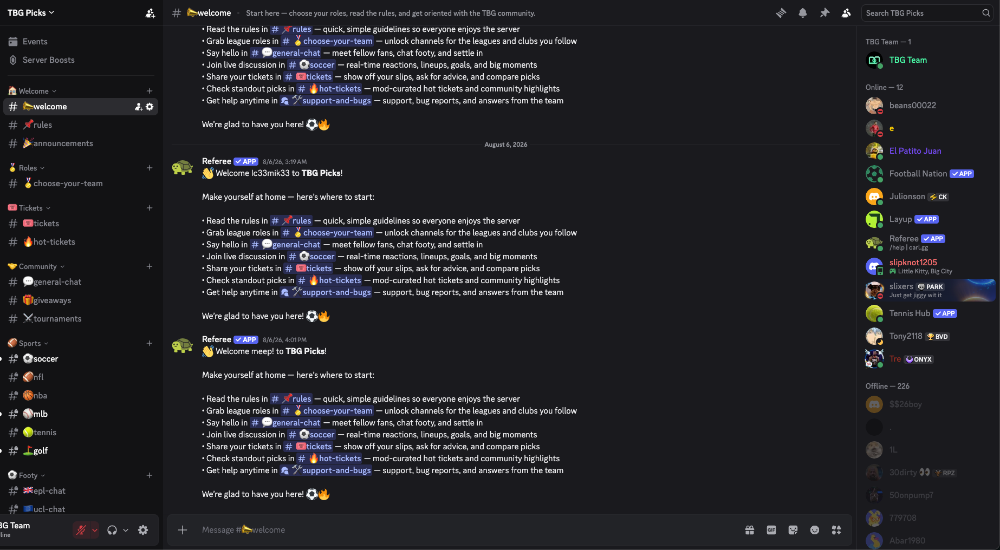
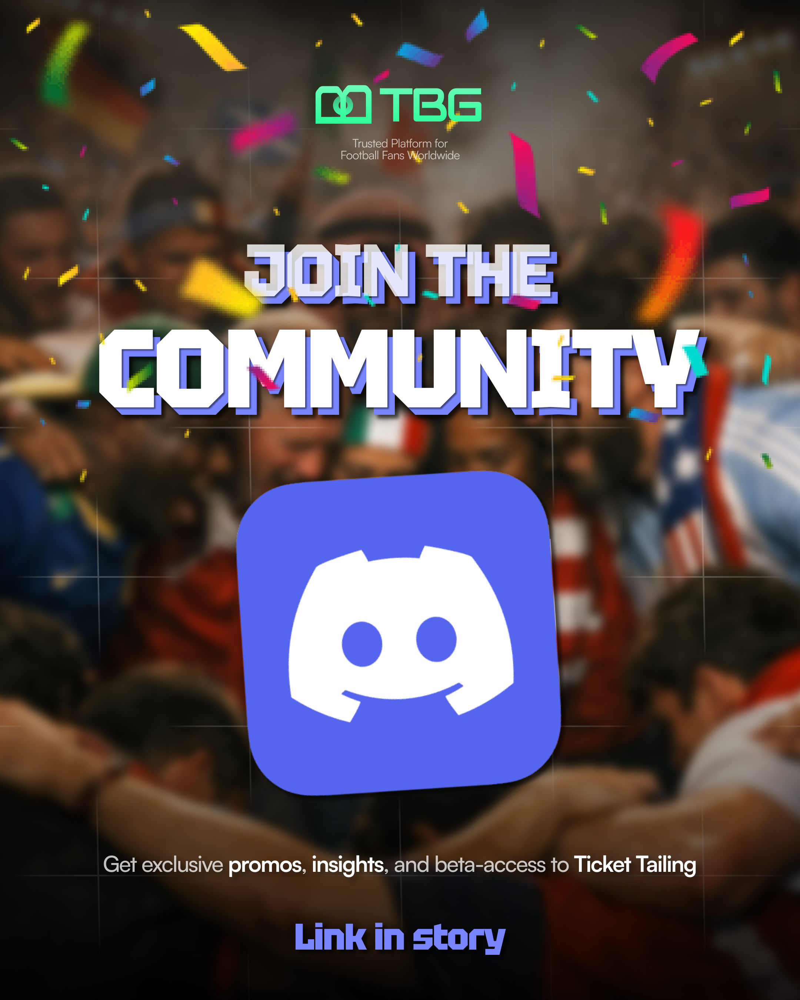
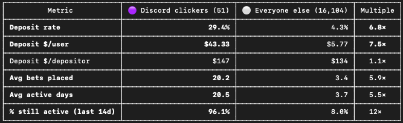

# Discord Community

**Turning community into a retention and customer-discovery system**

## Strategic Context

One of TBG's core product goals was to differentiate through community.

Competitive research showed that sports products could create meaningful brand loyalty through communities that existed beyond the transactional product itself.

I proposed building a dedicated TBG Discord server rather than relying entirely on one-way social media channels.

---

## Community Design

I built and moderated the server myself.

Instead of creating only a general chat, I structured it around different reasons a sports fan might return:

- General discussion
- Sport-specific channels
- League-specific channels
- Ticket sharing
- Hot-ticket discussion
- Tournaments
- Giveaways
- Product feedback
- Bug reports
- Announcements
- Live score updates

<p align="center">
  
</p>

I also integrated bots that automatically surfaced updates from major games.

The goal was to make the community valuable even when a user was not actively placing picks.

---

## Product Integration

I advocated for placing a direct Discord link inside the app.

That created an internal tradeoff:

Sending users to a third-party platform could temporarily remove them from TBG's core experience.

My hypothesis was that the long-term benefits would outweigh that cost:

- Stronger brand affinity
- More frequent sports engagement
- Direct customer feedback
- Community identity
- Product discovery
- Exclusive events and rewards

<p align="center">
  
</p>

---

## Customer Discovery

The Discord became one of our most useful direct feedback channels.

Users could:

- Report bugs
- Request features
- Discuss confusing product behavior
- Share what they wanted added
- Explain how they were actually using the app

This feedback directly influenced future product work.

One concrete example was the expanded **Achievements** system, which began after regular Discord users asked for more badges they could earn.

The server therefore created a loop:

```text
Community
    ↓
Feedback
    ↓
Product Insight
    ↓
PRD / Feature Decision
    ↓
Ship
    ↓
Return to Community
```

---

## Scale

The Discord ultimately grew to approximately **240 members**.

Because users could also join through external links and invitations, not every Discord member could be reliably mapped back to a product account.

For behavioral analysis, we therefore used a narrower cohort of users identified through the instrumented **in-app Discord link**.

---

## Cohort Behavior

<p align="center">
  
</p>

That tracked cohort showed:

- **29.4% deposit rate vs. 4.3%**
- **$43.33 deposit dollars per user vs. $5.77**
- **20.2 average picks vs. 3.4**
- **20.5 average active days vs. 3.7**
- **96.1% active in the most recent 14 days vs. 8.0%**

---

## Analytical Limitation

These differences should **not** be interpreted as Discord causing a 6–12× improvement in user quality.

The users willing to join a product's Discord are likely to be unusually engaged before joining.

The strategic conclusion was narrower:

> TBG's Discord became a home for an exceptionally high-value cohort and gave the product team direct, continuous access to highly engaged users.

That made it valuable as both a community asset and a product-development channel.

---

## What I Learned

Community can serve multiple product functions simultaneously.

Discord was:

- A retention surface
- A brand-building channel
- A support channel
- A customer-research tool
- A feature-feedback system
- A launch channel
- A reward mechanism

The most important outcome was not the member count alone.

It was shortening the distance between **users experiencing a problem** and **the people deciding what TBG should build next**.