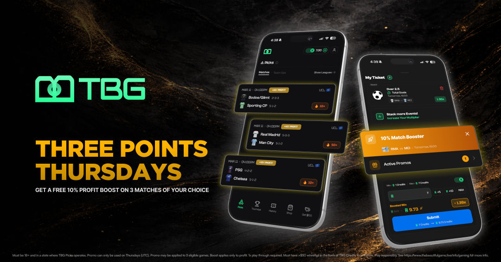
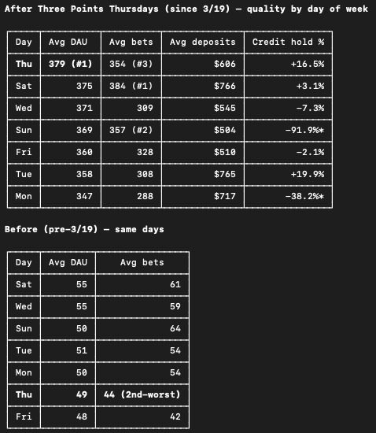

# Three Points Thursday

**Redirecting promotional spend toward incremental behavior**

## Problem

TBG initially used large profit boosts on selected high-profile matches.

These promotions were easy to understand and market, but I questioned whether we were allocating incentive value efficiently.

The biggest matches already generated organic demand.

That raised a simple question:

> Why spend our strongest incentives subsidizing behavior users were already likely to perform?

---

## Analysis

I analyzed product behavior across the days of the week.

At the time, Thursday consistently represented one of our weakest recurring periods across important engagement and commercial measures.

Instead of selecting another marquee match to boost, I proposed targeting the weak **time period itself**.

---

## Hypothesis

If promotional incentives were shifted toward a low-demand day, we could generate more incremental activity with a smaller individual incentive.

The concept became:

# Three Points Thursday

Users placing eligible tickets on Thursday could apply a **10% profit boost** to up to three tickets.

The games themselves did not need to occur on Thursday.

This distinction was intentional.

The behavior we wanted to change was:

> **When does the user return and place the ticket?**

not:

> **Which games must the user choose?**

---

## Naming & Positioning

The name came from soccer's familiar concept of earning **three points** for a win.

It also created a simple recurring cadence:

> Three Points Thursday

The alliteration made the promotion easy to remember and allowed it to become a recognizable weekly event rather than another generic boost.

  

[View the launch video](../assets/launch/TBG-Ad-TPT.mp4)

I also created launch creative and promotional materials for the initiative.

---

## Results

Within the analyzed user base, **15.8% placed a ticket using the Three Points Thursday promotion**.

The post-launch weekday comparison showed:

  

During the measured post-launch period:

- Thursday became the **#1 weekday for average DAU**
- Thursday ranked **#3 for average bets**
- Thursday averaged approximately **$606 in deposits**
- Thursday maintained a **+16.5% credit hold**
- That hold percentage was the **second-highest positive hold of the week**

---

## Why Relative Performance Matters

The company itself was growing rapidly during this period.

Therefore, comparing raw Thursday volume before and after launch would overstate the effect of the promotion.

The more informative signal was Thursday's performance **relative to the other weekdays during the same post-launch environment**.

Thursday moved from a historically weak day into one of the strongest recurring days while maintaining positive unit economics.

---

## Product Principle

The lesson was broader than one promotion:

> **Incentives should be used where they are most likely to change behavior, not where engagement is already strongest.**

Three Points Thursday was an example of using product analytics to redirect promotional value toward incremental demand rather than simply maximizing the visibility of a campaign.